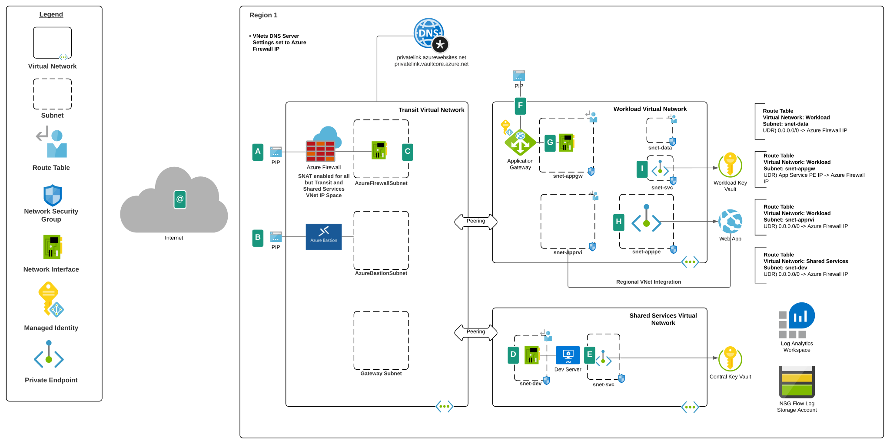

# Mediation Pattern for Application Gateway and App Services

## Overview
Organizations in regulated industries are typically required to mediate and inspect traffic between users and applications when the application provides access to sensitive data. While the capabilities in Web Application Firewalls are becoming more robust, many organizations still prefer to pass the traffic through a traditional firewall for additional IDS/IPS and centralized logging of all network traffic.

Using a hub and spoke architecture, this lab environment demonstrates a pattern where a publicly-facing [Application Gateway running in the dedicated workload Virtual Network](https://github.com/mattfeltonma/azure-networking-patterns#single-nva-internet-to-azure-http-and-https-with-ids-ips-option-2) exposes an application running in a multi-tenant Azure App Service Plan which has been configured with a [Private Endpoint](https://docs.microsoft.com/en-us/azure/private-link/private-endpoint-overview) and [Regional VNet (Virtual Network) Integration](https://docs.microsoft.com/en-us/azure/app-service/web-sites-integrate-with-vnet#regional-vnet-integration). Routing and SNAT has been configured so that traffic between the Application Gateway and App Service Private Endpoint is mediated by an [Azure Firewall](https://docs.microsoft.com/en-us/azure/firewall/overview) instance.

In addition to the above, the lab comes with the following features:

1. A [simple Python Web App](https://github.com/mattfeltonma/python-sample-web-app) deployed to App Services which retrieves the current time from a public API.
2. All resources that support diagnostic settings are configured to log to the Log Analytics Workspace.
3. Windows Server 2019 VM instance deployed with Azure CLI, Az PowerShell, Visual Studio Code, Google Chrome, and Windows RSAT (Remote Server Administration Tools).
4. Key Vault instance deployed with a Private Endpoint in the Shared Services Virtual Network and stores username and password for Dev virtual machine.
5. Key Vault instance deployed with a Private Endpoint in the Workload Virtual Network and stores the certificate used for the Application Gateway listener.
6. [Application Gateway is configured with a User-Assigned Managed Identity](https://docs.microsoft.com/en-us/azure/application-gateway/key-vault-certs) which has been granted appropriate permissions to access certificates stored in the Key Vault instance.
7. All Virtual Networks configured to use D[NS proxy feature of Azure Firewall](https://docs.microsoft.com/en-us/azure/firewall/dns-settings#dns-proxy) for resolution to Azure Private DNS Zones.

## Prerequisites
1. You must hold at least the Contributor role on the subscription(s) you are deploying the lab resources to.
    
2. Get the object id of the security principal (user, managed identity, service principal) that will have access to the Azure Key Vault instance. This will be used for the keyVaultAdmin parameter of the template.

    `az ad user show --id someuser@sometenant.com --query objectId --output tsv`

3. Enable Network Watcher in the region you plan to deploy the resources using the Azure Portal method described in [this link](https://docs.microsoft.com/en-us/azure/network-watcher/network-watcher-create#create-a-network-watcher-in-the-portal). Do not use the CLI option because the templates expect the Network Watcher resource to be named NetworkWatcher_REGION, such as NetworkWatcher_eastus2. The CLI names the resource watcher_REGION such as watcher_eastus2 which will cause the deployment of the environment to fail.

## Deployment
Use the Deploy to Azure button below. Note that the template will take about 1 hour to fully deploy. 

**The template allows for the following parameters**
* customWebDomain - The domain you'll be using to access the application publicly. The Application Gateway will be configured with an https listener for this domain. If this is a zone you do not own and do not have access to administer DNS you will need to modify the host file of the machine you are using the test the solution.
* sharedServicesSubId - The subscription id of the subscription to deploy the Shared Services resources to
* transitServicesSubId - The subscription id of the subscription to deploy the Transit resources to
* workloadSubId - The subscription id of the subscription to deploy the Workload resources to 
* location - The region the resources will be provisioned to.
* keyVaultAdmin - The object id of the user or group security principal that will be the administrator of the Key Vault. Note that the permissions assigned to the security principal exclude destructive permissions such as purge. Review the permissions in the /templates/general/deploy-keyvault.json template for a detailed list of the permissions.
* vmAdminUsername - The username for the local administrators of the two virtual machines provisioned. This will also be the name of the built-in Domain Administrator in the Active Directory domain.
* vmAdminPassword - The password assigned to the local administrator account of the virtual machines, the Active Directory domain administrator account, and the sample Active Directory user accounts. You can change these later on to improve the security posture of the environment. This must be supplied as a secure string.

## Post Deployment Steps

At this point your application is good to go to be accessed over the public Internet from your own machine. If you own the domain you used for the DOMAIN_NAME value you can go about setting up the appropriate DNS records with your DNS provider. If you do not own the domain, then you can optionally [modify the hosts file](https://www.groovypost.com/howto/edit-hosts-file-windows-10/) on your machine to resolve the record to the public IP address of the Application Gateway, such as www.mydomain.com.

