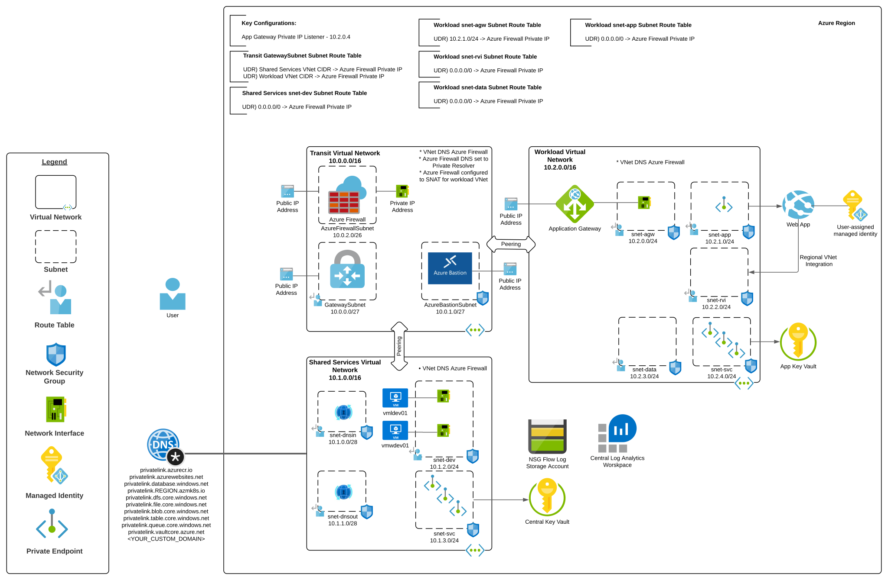

# Application Gateway and Hub and Spoke Lab

## Updates
* 12/2022
  * Updated base environment
  * Added more complex web app

## Overview
Organizations in regulated industries are typically required to mediate and inspect traffic between users and applications when the application provides access to sensitive data. While the capabilities in Web Application Firewalls are becoming more robust, many organizations still prefer to pass the traffic through a traditional firewall for additional IDS/IPS and centralized logging of all network traffic.

Using a hub and spoke architecture, this lab environment demonstrates a pattern where a publicly-facing [Application Gateway running in the dedicated workload Virtual Network](https://github.com/mattfeltonma/azure-networking-patterns#single-nva-internet-to-azure-http-and-https-with-ids-ips-option-2) exposes an application running in a multi-tenant Azure App Service Plan which has been configured with a [Private Endpoint](https://docs.microsoft.com/en-us/azure/private-link/private-endpoint-overview) and [Regional VNet (Virtual Network) Integration](https://docs.microsoft.com/en-us/azure/app-service/web-sites-integrate-with-vnet#regional-vnet-integration). 

A [hub and spoke networking architecture](https://docs.microsoft.com/en-us/azure/architecture/reference-architectures/hybrid-networking/hub-spoke?tabs=cli) is used to allow for segmentation of virtual networks. [UDRs (User defined routes)](https://docs.microsoft.com/en-us/azure/virtual-network/virtual-networks-udr-overview#user-defined) are configured to route all outgoing traffic and traffic between spokes through the Azure Firewall in the hub Virtual Network. Network Security Groups are configured on all subnets to support microsegmentation within a given Virtual network. A VPN Virtual Network Gateway is provisioned and ready for S2S or P2S connections.

All virtual networks are configured to use the Azure Firewall as a DNS provider to allow for logging of DNS queries. The Azure Firewall is configured to use an Azure Private DNS Resolver in the Shared Services virtual network for its resolution to support conditional forwarding to on-premises. Common Private DNS Zones for Azure PaaS services are created and linked to the Shared Services virtual network which allows the Private DNS Resolver to resolve records for Private Endpoints created in the environment.

Ubuntu and Windows virtual machines are deployed as utility servers. The Windows VM is provisioned with Google Chrome, Visual Studio Code, Azure CLI, and Azure PowerShell. The Linux VM is provisioned with Azure CLI, kubectl, and Docker.

The workload virtual network contains the Application Gateway and App Service. Routing and SNAT has been configured so that traffic between the Application Gateway and App Service Private Endpoint is mediated by an [Azure Firewall](https://docs.microsoft.com/en-us/azure/firewall/overview) instance.

Additional features included:

* A [simple Python Web App](https://github.com/mattfeltonma/python-sample-web-app) deployed to App Services which retrieves the current time from a public API and a secret from Key Vault
* App Service is provisioned with a managed identity which it used to interact with the Azure Key Vault
* [Application Gateway is configured with a User-Assigned Managed Identity](https://docs.microsoft.com/en-us/azure/application-gateway/key-vault-certs) which has been granted appropriate permissions to access certificates stored in the Key Vault instance.
* Azure Bastion provisioned in the hub to provide SSH and RDP (Remote Desktop Protocol) to deployed virtual machines
* Diagnostic logging configured for most resources to log to the Log Analytics Workspace
* An Azure Key Vault instance which stores the user configured VM administrator username and password
* All instances of Azure Key Vault are deployed with a Private Endpoint
* Network Security Groups are configured with NSG Flow Logs which are set to an Azure Storage Account and Traffic Analytics
* Subnets are configured so that Private Endpoints support Network Security Groups

## Prerequisites
1. You must hold at least the Contributor role within each Azure subscription you configure the template to deploy resources to.

2. Get the object id of the security principal (user, managed identity, service principal) that will have access to the Azure Key Vault instance. This will be used for the keyVaultAdmin parameter of the template. Ensure you are using the most up to date version of az cli.

**az ad user show --id someuser@sometenant.com --query id --output tsv**

3. Enable Network Watcher in the region you plan to deploy the resources using the Azure Portal method described in this link. Do not use the CLI option because the templates expect the Network Watcher resource to be named NetworkWatcher_REGION, such as NetworkWatcher_eastus2. The CLI names the resource watcher_REGION such as watcher_eastus2 which will cause the deployment of the environment to fail.

## Installation with Azure Portal

## Installation with Azure CLI
1. Set the following variables:
   * DEPLOYMENT_NAME - The name of the location
   * DEPLOYMENT_LOCATION - The location to create the deployment
   * LOCATION - The location to create the resources
   * CUSTOM_WEB_DOMAIN - The domain used to access the application publicly. The Application Gateway will be configured with an https listener for this domain. If this is a zone you do not own and do not have access to administer DNS you will need to modify the host file of the machine you are using the test the solution.
   * ADMIN_USER_NAME - The name to set for the VM administrator username
   * ADMIN_OBJECT_ID - The object ID of the Azure AD User that will have full permissions on the Key Vault instances
   * SUBSCRIPTION - The name or id of the subscription you wish to deploy the resources to
   * ON_PREM_ADDRESS_SPACE - This is an optional parameter that represents on-premises address space

2. Set the CLI to the subscription you wish to deploy the resources to:

   * **az account set --subscription SUBSCRIPTION_ID**

4. Deploy the lab using the command (tags parameter is optional): 

   * **az deployment sub create --name $DEPLOYMENT_NAME --location $DEPLOYMENT_LOCATION --template-uri https://raw.githubusercontent.com/mattfeltonma/azure-labs/master/hub-and-spoke/azuredeploy.json --parameters location=$LOCATION customWebDomain=$CUSTOM_WEB_DOMAIN vmAdminUsername=$ADMIN_USER_NAME keyVaultAdmin=$ADMIN_OBJECT_ID tags='{"mytag":"value"}'**

3.  You will be prompted to provide a password for the local administrator of the virtual machine. The username and password you set will be available to you as secrets in the "central" Key Vault provisioned as part of this lab.

## Post Installation
1. Once the lab is deployed, you can SSH into the Dev VM running in the hub using Azure Bastion.
2. If you own the domain you used for the DOMAIN_NAME value you can go about setting up the appropriate DNS records with your DNS provider. If you do not own the domain, then you can optionally [modify the hosts file](https://www.groovypost.com/howto/edit-hosts-file-windows-10/) on your machine to resolve the record to the public IP address of the Application Gateway, such as www.mydomain.com.

