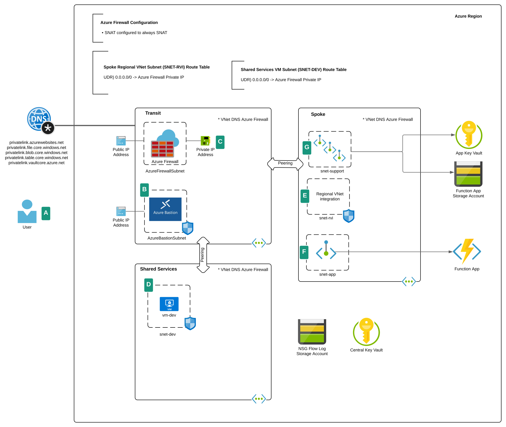

# Azure Function with Private Endpoint and Regional VNet Integration

## Overview
Organizations in regulated industries are often required to mediate and sometimes inspect traffic to and from applications or code that provide access to or are capable of accessing sensitive data. These applications or code may also need to access resources which exists on-premises or are being exposed only within a customer's private network within a public cloud provider using a feature such as Microsoft Azure's [Private Endpoints](https://docs.microsoft.com/en-us/azure/private-link/private-endpoint-overview). While influencing incoming and outgoing network for applications or code running in an IaaS (Infrastructure-as-a-Service) offering is straightforward, the patterns differ when using PaaS (Platform-as-a-Service).

[Azure Functions](https://docs.microsoft.com/en-us/azure/azure-functions/) is a serverless PaaS offering in Microsoft Azure which can be used to run code based upon a trigger or event. Common use cases include Web APIs, performing simple data processing, or even automatically remediating a resource which has drifted out of compliance. Azure Functions can run in both a dedicated enviroment with an [ASE (App Services Environment)](https://docs.microsoft.com/en-us/azure/app-service/environment/) or in a multi-tenant environment with a [Consumption or Premium plan](https://docs.microsoft.com/en-us/azure/azure-functions/functions-scale#overview-of-plans).

When running an Azure Function in a multi-tenant environment using a Premium Plan, Microsoft provides two separate features to allow for influencing incoming and outgoing networking traffic. [Private Endpoints](https://docs.microsoft.com/en-us/azure/private-link/private-endpoint-overview) provide the customer with the ability to create a network interface for the Azure Function within their Azure VNet (Virtual Network) to influence incoming traffic. [Regional VNet Integration](https://docs.microsoft.com/en-us/azure/app-service/web-sites-integrate-with-vnet#regional-vnet-integration) provides the customer with the ability to force outgoing traffic from the Azure Function to flow through the customer's VNet.

This deployable lab provides a simple way to test and experiment with these features. It deploys an Azure Function configured with a Private Endpoint and Regional VNet integration. A [simple web application](https://github.com/mattfeltonma/azure-function-example) is deployed to the Azure Function, which when accessed, will query a public API for the current time and display a secret word pulled from an instance of Azure Key Vault. The function is deployed into a [hub and spoke networking architecture](https://docs.microsoft.com/en-us/azure/architecture/reference-architectures/hybrid-networking/hub-spoke?tabs=cli). [UDRs (User defined routes)](https://docs.microsoft.com/en-us/azure/virtual-network/virtual-networks-udr-overview#user-defined) assigned to the subnet delegated for Regional VNet integration are used to force outgoing traffic from the function through an Azure Firewall which is provisioned into the hub VNet.

A Windows Server 2019 VM (virtual machine) is deployed into a Shared Services VNet and is provisioned with Windows Remote Server Administration Tools, Google Chrome, Azure CLI, Azure PowerShell, and Visual Studio Code. UDRs assigned to the VM's subnet are used to force traffic destined to the Azure Function through the Azure Firewall instance.

Additional features included:

* Azure Storage Account used by the Function is deployed behind a Private Endpoint
* Azure Bastion provisioned in the hub to provide secure RDP (Remote Desktop Protocol) access to the VM
* Azure Firewall configured to send diagnostic logs to an instance of Log Analytics Workspace to allow for review of the traffic flowing to and from the Azure Function
* Azure Function integrated with an instance of App Insights
* An Azure Key Vault instance which stores the user configured VM administrator username and password
* An Azure Key Vault instance which stores a secret word that is displayed to the user when accessing the Azure Function
* All instances of Azure Key Vault are deployed with a Private Endpoint

## Prerequisites
1. You must hold at least the Contributor role within each Azure subscription you configure the template to deploy resources to.

2. Get the object id of the security principal (user, managed identity, service principal) that will have access to the Azure Key Vault instance. This will be used for the keyVaultAdmin parameter of the template.

**az ad user show --id someuser@sometenant.com --query objectId --output tsv**

3. Enable Network Watcher in the region you plan to deploy the resources using the Azure Portal method described in this link. Do not use the CLI option because the templates expect the Network Watcher resource to be named NetworkWatcher_REGION, such as NetworkWatcher_eastus2. The CLI names the resource watcher_REGION such as watcher_eastus2 which will cause the deployment of the environment to fail.

## Installation with Azure Portal

## Installation with Azure CLI
1. Set the following variables:
   * DEPLOYMENT_NAME - The name of the location
   * DEPLOYMENT_LOCATION - The location to create the deployment
   * LOCATION - The location to create the resources
   * ADMIN_USER_NAME - The name to set for the VM administrator username
   * ADMIN_OBJECT_ID - The object ID of the Azure AD User that will have full permissions on the Key Vault instances
   * SUBSCRIPTION - The name or id of the subscription you wish to deploy the resources to

2. Set the CLI to the subscription you wish to deploy the resources to:

**az account set --subscription SUBSCRIPTION_ID

4. Deploy the lab using the command: 

**az deployment sub create --name $DEPLOYMENT_NAME --location $DEPLOYMENT_LOCATION --template-uri https://raw.githubusercontent.com/mattfeltonma/azure-labs/master/function-pe-rvi/azuredeploy.json --parameters location=$LOCATION vmAdminUsername=$ADMIN_USER_NAME keyVaultAdmin=$ADMIN_OBJECT_ID**

3.  You will be prompted to provide a password for the local administrator of the virtual machine.

## Post Installation
Once the lab is deployed, you can RDP into the VM running in the hub using Azure Bastion. Once in the VM, open up an instance of Google Chrome and navigate to the function endpoint. The function endpoint is structured as follows: https://FUNCTION_NAME.azurewebsites.net/api/pythonsample.

