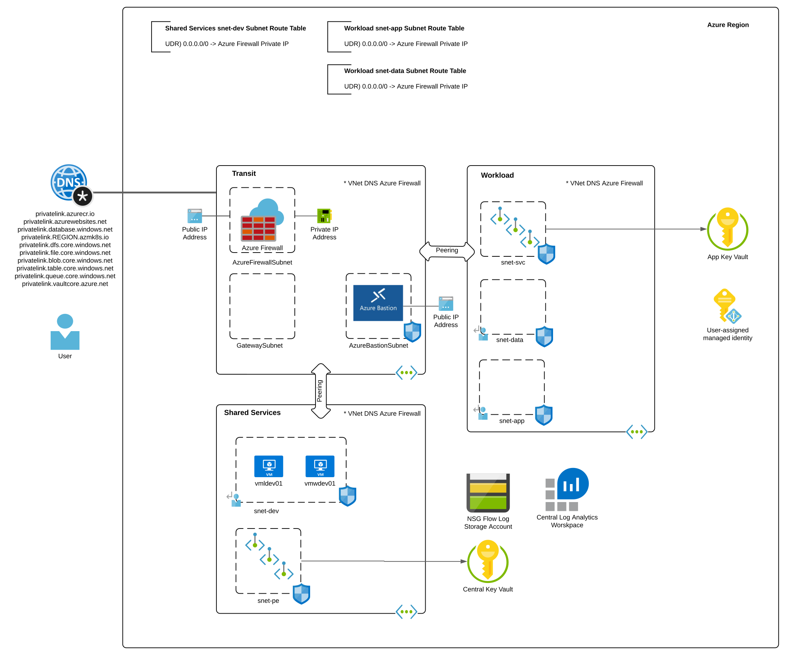

# Azure Hub and Spoke Base Lab

## Updates
* 11/2022
* * Added Private DNS Resolver for DNS resolution
* * Configured Azure Firewall to use Private DNS Resolver as DNS server to allow capturing of DNS queries on Azure Firewall
* * Added diagnostic logging for NSG Flow Log storage account

* 9/2022
* * Added Virtual Network Gateway and configured it to support BGP
* * Added route table to GatewaySubnet with routes for both shared services and workload vnets to point to Azure Firewall
* * Modified all subnets in shared services and workload vnets to enable Private Endpoint Network Policies to support NSGs support for Private Endpoints and routing enhancements

## Overview
This deployable lab provides a simple way to experiment with Azure workloads in an enterprise-like environment. Three resource groups are deployed with one for transit resources, one for shared services, and one for a workload. Each resource group contains resources that would typically be included in a baseline enterprise Azure deployment. The template supports each of these resource groups being provisioned in separate subscription if required.

A [hub and spoke networking architecture](https://docs.microsoft.com/en-us/azure/architecture/reference-architectures/hybrid-networking/hub-spoke?tabs=cli) is used to allow for segmentation of virtual networks. [UDRs (User defined routes)](https://docs.microsoft.com/en-us/azure/virtual-network/virtual-networks-udr-overview#user-defined) are configured to route all outgoing traffic and traffic between spokes through the Azure Firewall in the hub Virtual Network. Network Security Groups are configured on all subnets to support microsegmentation within a given Virtual network. A VPN Virtual Network Gateway is provisioned and ready for S2S or P2S connections.

All virtual networks are configured to use the Azure Firewall as a DNS provider to allow for logging of DNS queries. The Azure Firewall is configured to use an Azure Private DNS Resolver in the Shared Services virtual network for its resolution to support conditional forwarding to on-premises. Common Private DNS Zones for Azure PaaS services are created and linked to the Shared Services virtual network which allows the Private DNS Resolver to resolve records for Private Endpoints created in the environment.

Ubuntu and Windows virtual machines are deployed as utility servers. The Windows VM is provisioned with Google Chrome, Visual Studio Code, Azure CLI, and Azure PowerShell. The Linux VM is provisioned with Azure CLI, kubectl, and Docker.

The Workload virtual network is deployed with three subnets. These include an app, data, and supporting services (PaaS services behind Private Endpoints) subnet. The workload resource group also contains a user-assigned managed identity which has been given permissions to get and list secrets in a Key Vault instance.

Additional features included:

* Azure Bastion provisioned in the hub to provide SSH and RDP (Remote Desktop Protocol) to deployed virtual machines
* Diagnostic logging configured for most resources to log to the Log Analytics Workspace
* An Azure Key Vault instance which stores the user configured VM administrator username and password
* All instances of Azure Key Vault are deployed with a Private Endpoint
* Network Security Groups are configured with NSG Flow Logs which are set to an Azure Storage Account and Traffic Analytics
* Subnets are configured so that Private Endpoints support Network Security Groups

## Prerequisites
1. You must hold at least the Contributor role within each Azure subscription you configure the template to deploy resources to.

2. Get the object id of the security principal (user, managed identity, service principal) that will have access to the Azure Key Vault instance. This will be used for the keyVaultAdmin parameter of the template. Ensure you are using the most up to date version of az cli.

**az ad user show --id someuser@sometenant.com --query id --output tsv**

3. Enable Network Watcher in the region you plan to deploy the resources using the Azure Portal method described in this link. Do not use the CLI option because the templates expect the Network Watcher resource to be named NetworkWatcher_REGION, such as NetworkWatcher_eastus2. The CLI names the resource watcher_REGION such as watcher_eastus2 which will cause the deployment of the environment to fail.

## Installation with Azure Portal

## Installation with Azure CLI
1. Set the following variables:
   * DEPLOYMENT_NAME - The name of the location
   * DEPLOYMENT_LOCATION - The location to create the deployment
   * LOCATION - The location to create the resources
   * ADMIN_USER_NAME - The name to set for the VM administrator username
   * ADMIN_OBJECT_ID - The object ID of the Azure AD User that will have full permissions on the Key Vault instances
   * SUBSCRIPTION - The name or id of the subscription you wish to deploy the resources to
   * ON_PREM_ADDRESS_SPACE - This is an optional parameter that represents on-premises address space

2. Set the CLI to the subscription you wish to deploy the resources to:

   * **az account set --subscription SUBSCRIPTION_ID**

4. Deploy the lab using the command (tags parameter is optional): 

   * **az deployment sub create --name $DEPLOYMENT_NAME --location $DEPLOYMENT_LOCATION --template-uri https://raw.githubusercontent.com/mattfeltonma/azure-labs/master/hub-and-spoke/azuredeploy.json --parameters location=$LOCATION vmAdminUsername=$ADMIN_USER_NAME keyVaultAdmin=$ADMIN_OBJECT_ID tags='{"mytag":"value"}'**

3.  You will be prompted to provide a password for the local administrator of the virtual machine. The username and password you set will be available to you as secrets in the "central" Key Vault provisioned as part of this lab.

## Post Installation
Once the lab is deployed, you can SSH into the Dev VM running in the hub using Azure Bastion.

