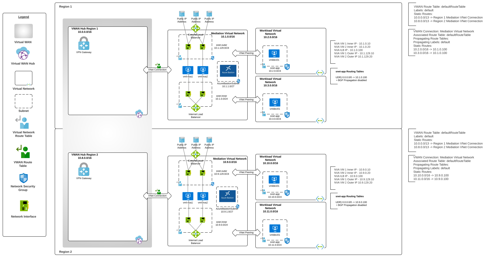

# Azure VWAN Single Region "VWAN Hub-and-Spoke-on-a-Stick"

## Updates
1/2023 - Initial release

## Overview
Microsoft has positioned [Azure VWAN (Virtual WAN)](https://learn.microsoft.com/en-us/azure/virtual-wan/virtual-wan-about) to be the next evolution of the traditional [hub and spoke networking architecture](https://docs.microsoft.com/en-us/azure/architecture/reference-architectures/hybrid-networking/hub-spoke?tabs=cli). VWAN provides new features that allow for out-of-the-box transitive connectivity, additional support for [SD-WAN connectivity](https://learn.microsoft.com/en-us/azure/virtual-wan/sd-wan-connectivity-architecture), [new routing capabilities](https://learn.microsoft.com/en-us/azure/virtual-wan/about-virtual-hub-routing), and even [managed security appliances](https://learn.microsoft.com/en-us/azure/firewall-manager/secured-virtual-hub?toc=%2Fazure%2Fvirtual-wan%2Ftoc.json). With any new product, there are feature gaps and VWAN is no exception. Organizations operating in regulated industries must exercise considerable planning to determine if VWAN's current capabilities and gaps will work for its organizational requirements.

This lab provides a multi-region environment supporting north/south and east/west traffic inspection and central mediationd deployed with common shared services and workload virtual networks. The network design used in this lab is referred to as a [hub-and-spoke-on-a-stick or an indirect spoke model](https://learn.microsoft.com/en-us/azure/virtual-wan/scenario-route-through-nva#architecture). This is one of the only designs today that supports east/west inspection across regions. It can be used to test and validate workloads in that use this network model.

The lab deploys an Azure Virtual WAN with a single VWAN hub in a single region. The VWAN hub is deployed with a VPN Gateway.

Directly attached to the VWAN Hub is a mediation virtual network. Within this virtual network there are two Ubuntu VMs configured with as simple firewalls using iptables and kernal support for VRFs. These VMs are placed behind both an internal and external load balancer. This configuration closely emualates a 3rd-party security appliance deployment such as Palo Alto firewalls. Quagga comes pre-installed and can configured to experiment with the [BGP support of VWAN](https://learn.microsoft.com/en-us/azure/virtual-wan/create-bgp-peering-hub-portal). An Azure Bastion instance is additionally deployed to each mediation VNet to allow for SSH access to the VMs in each region. 

Two virtual networks are peered to the mediation virtual network using virtual network peering. The shared services virtual network contains an [Azure Private DNS Resolver](https://learn.microsoft.com/en-us/azure/dns/dns-private-resolver-overview) and is linked to multiple Azure Private DNS Zones used by common Azure PaaS services. All virtual networks are configured to use the Private DNS Resolver for DNS resolution. Ubuntu and Windows VMs are deployed as utility servers. The Windows VM comes loaded with Google Chrome, Visual Studio Code, Azure CLI, and Azure PowerShell. The Linux VM comes loaded with Azure CLI, kubectl, and Docker. 

The workload is deployed with an app, data, and supported services (PaaS services behind Private Endpoints). The workload resource group also contains a user-assigned managed identity which has been given permissions to get and list secrets in a Key Vault instance.

Routing is configured such that north/south/east/west traffic flows through the VMs in the mediation virtual network. Traffic to and from on-premises flows through the VWAN hub after traversing the VMs in the mediation virtual network.

Additional features included:

* Azure Bastion provisioned in the hub to provide SSH and RDP (Remote Desktop Protocol) to deployed virtual machines
* An Azure Key Vault instance which stores the user configured VM administrator username and password
* An Azure Key Vault instance for workloads deployed into the workload resource group
* All instances of Azure Key Vault are deployed with a Private Endpoint
* All subnets that support Network Security Groups are configured with them except for the inner subnet used by the VMs in the mediation virtual network
* Network Security Groups are configured with NSG Flow Logs which are set to an Azure Storage Account and Traffic Analytics
* Subnets are configured so that Private Endpoints support Network Security Groups
* A Log Analytics Workspace is provisioned and can be used for centralized logging.
* Resources that support integration with Log Analytics have been configured for logging

## Prerequisites
1. You must hold at least the Contributor role within each Azure subscription you configure the template to deploy resources to.

2. Get the object id of the security principal (user, managed identity, service principal) that will have access to the Azure Key Vault instance. This will be used for the keyVaultAdmin parameter of the template. Ensure you are using the most up to date version of az cli.

**az ad user show --id someuser@sometenant.com --query id --output tsv**

3. Enable Network Watcher in the region you plan to deploy the resources using the Azure Portal method described in this link. Do not use the CLI option because the templates expect the Network Watcher resource to be named NetworkWatcher_REGION, such as NetworkWatcher_eastus2. The CLI names the resource watcher_REGION such as watcher_eastus2 which will cause the deployment of the environment to fail.

## Installation with Azure Portal

## Installation with Azure CLI
1. Set the following variables:
   * NAME - The name of the deployment
   * LOCATION - The primary Azure region to deploy the resources to.
   * ADMIN - The name to set for the VM administrator username
   * USER - The object ID of the Azure AD User that will have full permissions on the Key Vault instances
   * SUBSCRIPTION - The name or id of the subscription you wish to deploy the resources to

2. Set the CLI to the subscription you wish to deploy the resources to:

   * **az account set --subscription SUBSCRIPTION_ID**

4. Deploy the lab using the command (tags parameter is optional): 

   * **az deployment sub create --name $NAME --location $DLOCATION --template-uri https://raw.githubusercontent.com/mattfeltonma/azure-labs/master/vwan-hub-spoke-single-region/azuredeploy.json --parameters location=$LOCATION vmAdminUsername=$ADMIN keyVaultAdmin=$USER tags='{"mytag":"value"}'**

3.  You will be prompted to provide a password for the local administrator of the virtual machines. The username and password you set will be available to you as secrets in the Key Vault provisioned as part of this lab.

## Post Installation
Once the lab is deployed, you can SSH into the virtual machines using the Azure Bastion instance.

## Removal
Once finished with the lab you can delete the resource groups.

