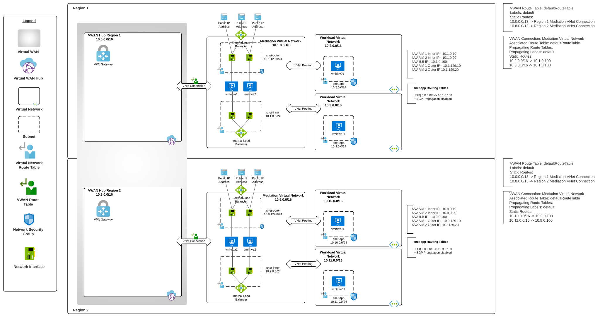

# Azure VWAN "VWAN Hub-and-Spoke-on-a-Stick - Multi-Region Lab"

## Updates
1/2023 - Initial release

## Overview
Microsoft has positioned [Azure VWAN (Virtual WAN)](https://learn.microsoft.com/en-us/azure/virtual-wan/virtual-wan-about) to be the next evolution of the traditional [hub and spoke networking architecture](https://docs.microsoft.com/en-us/azure/architecture/reference-architectures/hybrid-networking/hub-spoke?tabs=cli). VWAN provides new features that allow for out-of-the-box transitive connectivity, additional support for [SD-WAN connectivity](https://learn.microsoft.com/en-us/azure/virtual-wan/sd-wan-connectivity-architecture), [new routing capabilities](https://learn.microsoft.com/en-us/azure/virtual-wan/about-virtual-hub-routing), and even [managed security appliances](https://learn.microsoft.com/en-us/azure/firewall-manager/secured-virtual-hub?toc=%2Fazure%2Fvirtual-wan%2Ftoc.json). With any new product, there are feature gaps and VWAN is no exception. Organizations operating in regulated industries must exercise considerable planning to determine if VWAN's current capabilities and gaps will work for its organizational requirements.

This deployable lab seeks to demonstrate a pattern for regulated organizations that have requirements for inspection and mediation of north/south and east/west traffic (to and from the Internet). It is referred to as a [hub-and-spoke-on-a-stick or an indirect spoke model](https://learn.microsoft.com/en-us/azure/virtual-wan/scenario-route-through-nva#architecture). In my opinion, this is the only viable pattern with VWAN today to achieve north/south and east/west traffic inspection.

The lab deploys an Azure Virtual WAN with two VWAN hubs in different regions with each VWAN hub configured with a VPN Gateway. Each region includes a mediation virtual network that is connected to the VWAN hub. Two workload (or spoke) virtual networks are peered to the mediation virtual network using VNet peering. This creates a design that looks similar to a traditional hub-and-spoke architecture hence the name of hub-and-spoke-on-a-stick.

The mediation VNet contains two Ubuntu VMs configured with as simple firewalls using iptables and kernal support for VRFs. This configuration closely emualates a 3rd-party security appliance deployment such as Palo Alto firewalls. Quagga comes pre-installed and can configured to experiment with the [BGP support of VWAN](https://learn.microsoft.com/en-us/azure/virtual-wan/create-bgp-peering-hub-portal). An Azure Bastion instance is additionally deployed to each mediation VNet to allow for SSH access to the VMs in each region. 

Each Workload VNet contains a single Ubuntu VM. This machine can be used to test connectivity across the VWAN network.

Additional features included:

* An Azure Key Vault is provisioned to store the username and password configured for the virtual machines during deployment.
* A Log Analytics Workspace is provisioned and can be used for centralized logging.
* Resources that support integration with Log Analytics have been configured for logging
* Network Security Groups are configured for NSG Flow Logs

## Prerequisites
1. You must hold at least the Contributor role within each Azure subscription you configure the template to deploy resources to.

2. Get the object id of the security principal (user, managed identity, service principal) that will have access to the Azure Key Vault instance. This will be used for the keyVaultAdmin parameter of the template. Ensure you are using the most up to date version of az cli.

**az ad user show --id someuser@sometenant.com --query id --output tsv**

3. Enable Network Watcher in the region you plan to deploy the resources using the Azure Portal method described in this link. Do not use the CLI option because the templates expect the Network Watcher resource to be named NetworkWatcher_REGION, such as NetworkWatcher_eastus2. The CLI names the resource watcher_REGION such as watcher_eastus2 which will cause the deployment of the environment to fail.

## Installation with Azure Portal

## Installation with Azure CLI
1. Set the following variables:
   * NAME - The name of the deployment
   * DLOCATION - The location to create the deployment
   * PLOCATION - The primary Azure region to deploy the resources to.
   * SLOCATION - The secondary Azure region to deploy the resources to.
   * ADMIN - The name to set for the VM administrator username
   * USER - The object ID of the Azure AD User that will have full permissions on the Key Vault instances
   * SUBSCRIPTION - The name or id of the subscription you wish to deploy the resources to

2. Set the CLI to the subscription you wish to deploy the resources to:

   * **az account set --subscription SUBSCRIPTION_ID**

4. Deploy the lab using the command (tags parameter is optional): 

   * **az deployment sub create --name $NAME --location $DLOCATION --template-uri https://raw.githubusercontent.com/mattfeltonma/azure-labs/master/vwan-firewall-on-a-stick/azuredeploy.json --parameters primaryLocation=$PLOCATION secondaryLocation=$SLOCATION vmAdminUsername=$ADMIN keyVaultAdmin=$USER tags='{"mytag":"value"}'**

3.  You will be prompted to provide a password for the local administrator of the virtual machines. The username and password you set will be available to you as secrets in the Key Vault provisioned as part of this lab.

## Post Installation
Once the lab is deployed, you can SSH into the virtual machines from a machine associated with the trusted IP.

## Removal
Once finished with the lab you can delete the resource groups.

